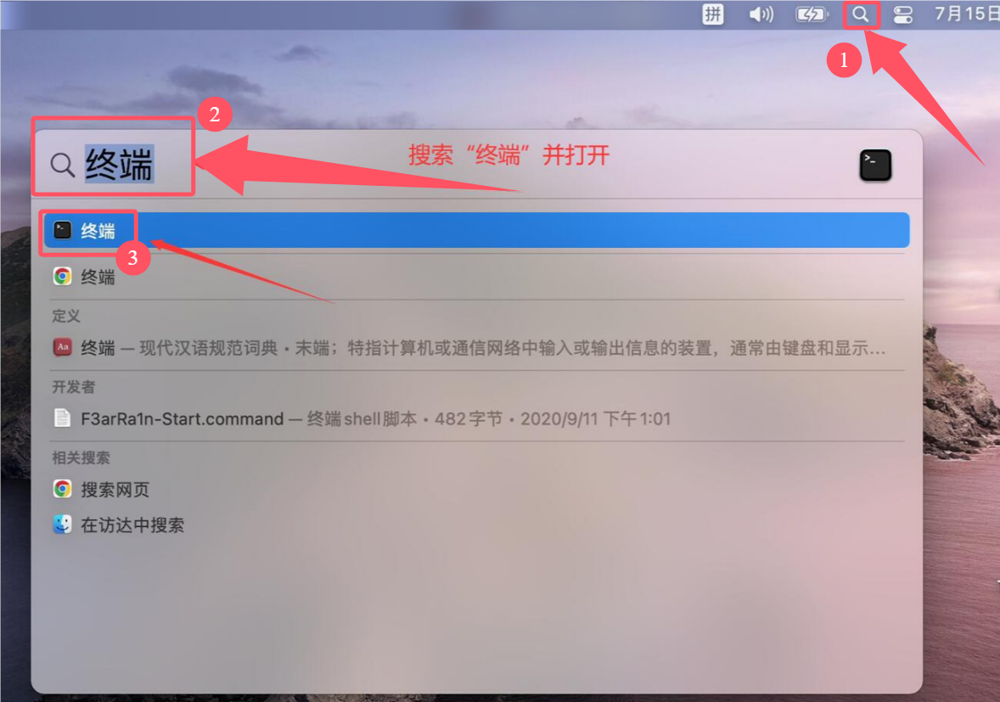

# Mac用户必看

如果您的系统版本是**10.13**或者10.14的,请忽略本教程直接去下载安装即可.如果是**10.15**及以上请按照以下步骤操作!

当然您也可以不用开启任何来源,如果遇到安装包打不开的话,这样子去打开即可:前往`设置—隐私与安全性—安全性(在设置最下面)—“仍要打开已拦截的xxxx.app”`

## 打开终端



## 粘贴代码

```shell
sudo spctl --master-disable
```

将以上代码复制到终端中,不要手敲,容易输出

输入完后回车,会提示输入开机密码(出现Password的字样)

直接将开机密码输入即可,输入密码过程中,终端不会显示然后文字信息,不用理会,输入完回车即可

## 检查

完成之后点击屏幕左上角的苹果:apple:图标,分别打开`系统偏好设置 -> 安全与隐私 -> 通用`检查是否已经开启了任何来源

### Mac OS 12及以下系统的图示


### Mac OS 13系统的图示

