# Mac系统安装使用报错解决办法

## PS另存为时没有jpg格式怎么解决?

打开PS,`Photoshop-首选项-文件处理`


勾选`启用旧版存储为`

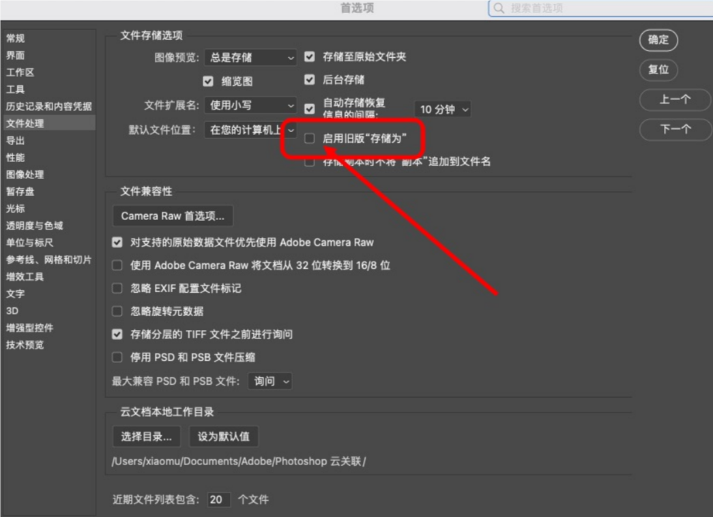

## PS里面没有Camera Raw滤镜怎么解决?

下载滤镜补丁,然后双击开始一键安装,成功后重启下PS即可

滤镜补丁的安装包在你下PS的地方有

## 如何勾选启用Rosetta

点电脑左下角访达,选择应用程序找到图片所指的这个PS2021的文件夹(以PS为例)


双击进入这个文件夹

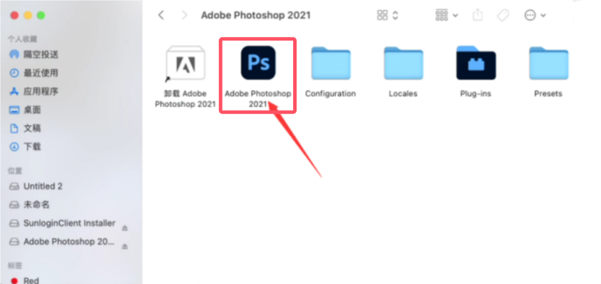

右键点显示简介


弹出图片页面之后勾上箭头所指的`使用rosetta打开`即可

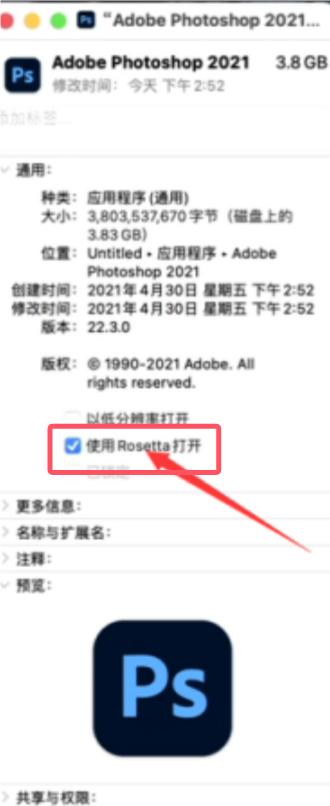

## Mac启动应用提示无法检查更新

在使用Mac的时候,启动一个软件,提示`无法检查更新,请确定你已接入互联网`

是因为没有启用rosetta.需要安装rosetta

解决方法:

开启WIFI网络

复制以下命令

```bash
/usr/sbin/softwareupdate --install-rosetta --agree-to-license
```

打开终端,粘贴上去,然后回车即可

然后重新打开应用即可正常安装

## 安装提示错误代码146怎么办?

解决方法一: 需要打开`系统设置-隐私与安全-App管理`,打开`Install`选项,然后选择`退出并重新打开`

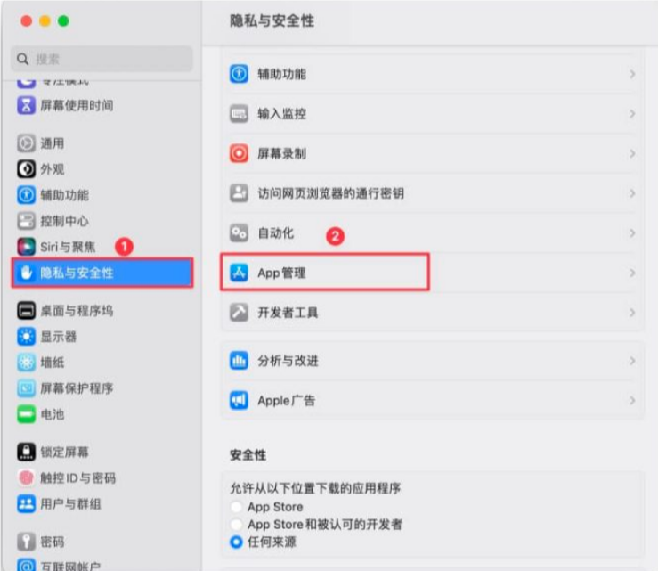


解决方法二: 安装AI新版的,上面的方法都用了还是报错146

当然前面的教程不是没用,解决问题就是各种办法相辅相成,最终解决问题,你现在可以尝试删除一个名为Core Sync.app的组件程序,路径如下`/Applications/Utilities（实用工具）/Adobe Sync`

也可以将Adobe Sync文件夹里的Core Sync文件夹直接删掉


到这里再次尝试安装你要安装的软件即可

> [!tip]
>
> CoreSync是CreativeCloud桌面应用程序的一个组件,也是其安装的一部分.CoreSync负责在您的Mac和CreativeCloud之间同步数据.它会将Mac上CreativeCloudFiles文件夹中的所有文件与Adobe服务器同步.CoreSync还会同步在AdobeXD和AdobePhotoshop等应用程序中创建的云文档.有时候报错146,就是这里有你之前安装的缓存破解!

## 错误代码127,1,131解决方法

出现问题原因:电脑以前有安装过其他版本的或者其他Adob系列的软件,造成缓存冲突

打开Mac电脑里的访达程序,点击屏幕顶部菜单栏里的`前往`,然后在弹出的下拉菜单中点击`前往文件夹`


最后,在弹出的窗口中,输入`/`斜杠,选择资源库,回车前往


选择`Application Support`文件夹打开


选择`Adobe`文件夹打开


删除`caps`和`OOBE`2个文件夹

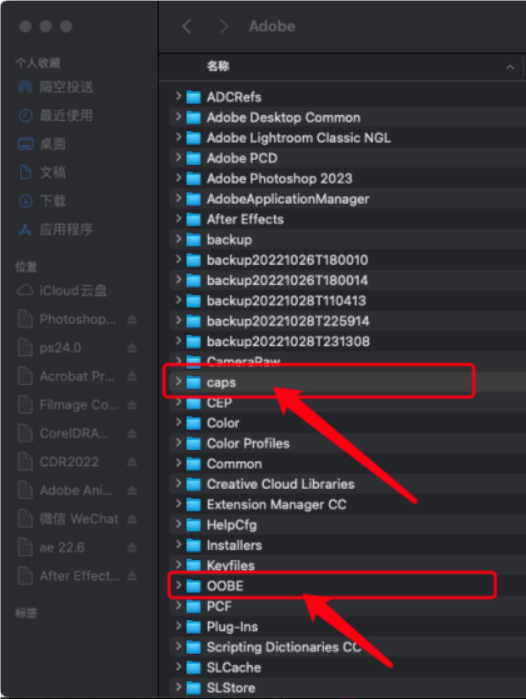

删除后清空废纸篓后在进行安装

## 解决41报错问题

安装程序错误代码:41,是因为你用某个优化工具禁用了Adob的开启代理项导致的,多半是一些优化类软件自动禁用的(如:腾讯柠檬清理,Cleanmymac等),因此我们只要用代理启动软件重新启用和Adob相关的启动项就可以了

解决方法:

下载app cleaner优化软件的Mac版本并安装.[点我下载](https://app-cleaner.com/zh-hans)

**初次打开这个软件的时候会提示需要对软件进行授权访问,请务必选择允许!**

打开软件选择左侧的启动程序 ,找到带有`Adobe`名称的代理项全部开启

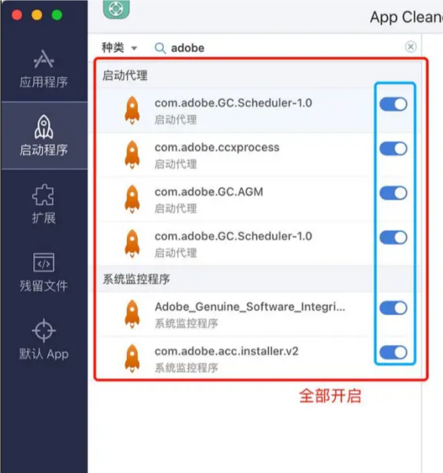

这时候我们再返回去重新安装软件,就可以完美安装成功了

## PS导出为发生未知错误?

解决PS`导出为`发生未知错误的解决方法

运行PS后,打开它的`首选项-技术预览`,勾选`启用优化的导出为`即可

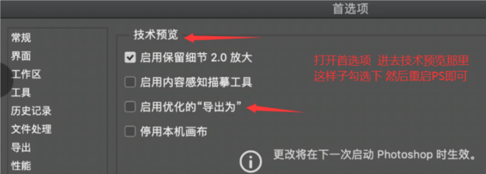

## 修复lrc权限错误

请跟着[这篇文档](https://www.yuque.com/yihulaojiu-gsfg9/zz2qv5/bwcq938n1anl6uy6)做

## 打开Install安装包报错解决方法

请用这个步骤打开


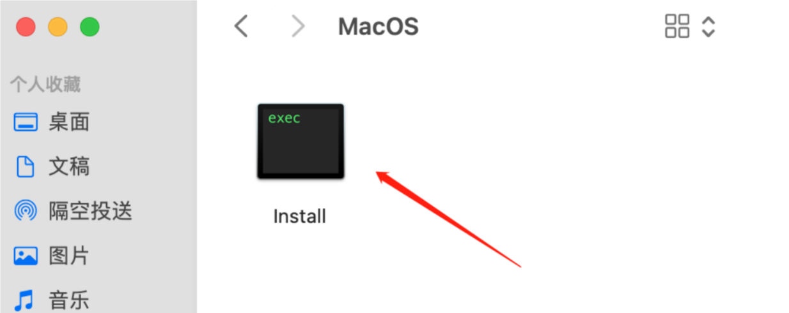


## MacAdob程序正确卸载教程

打开访达,应用程序(以PS为例)

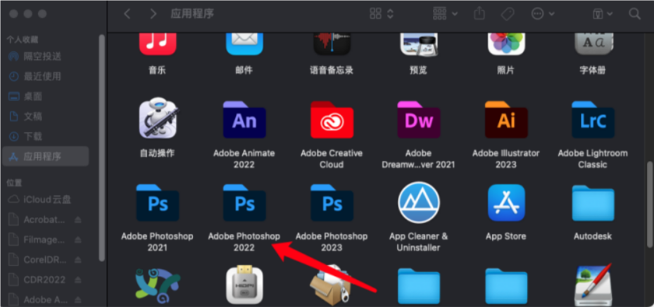

找到需要卸载的程序,双击进去

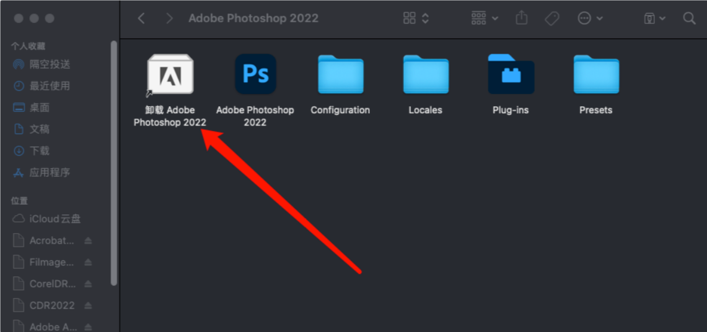

双击打开卸载程序

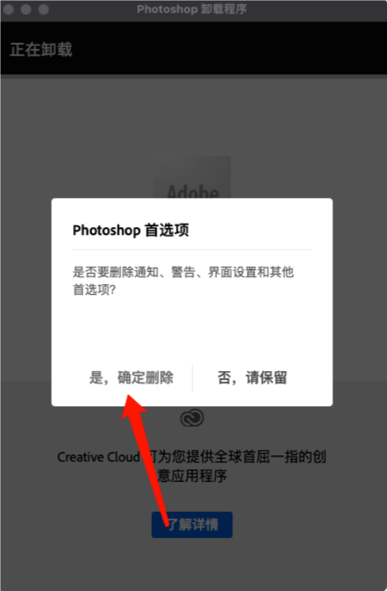

点击`是,确定删除`,等待进度条走完即可正确删除