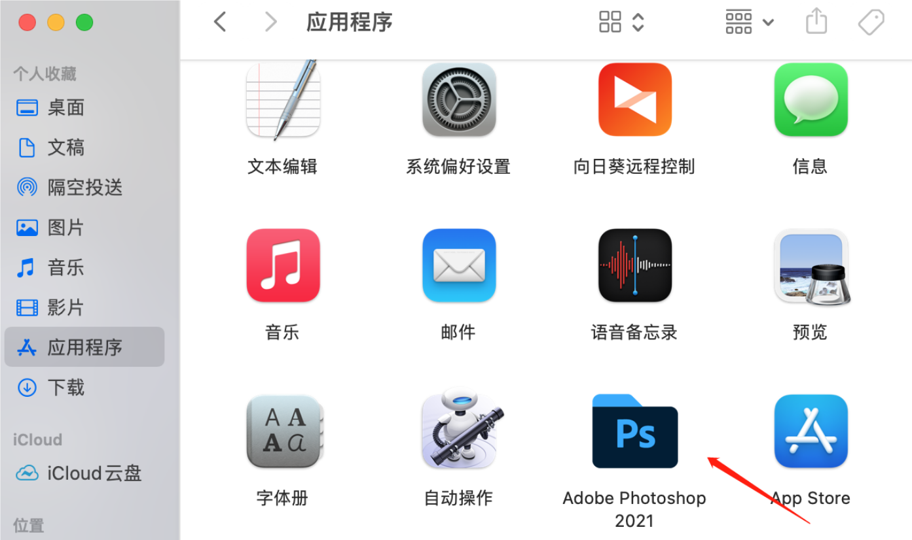
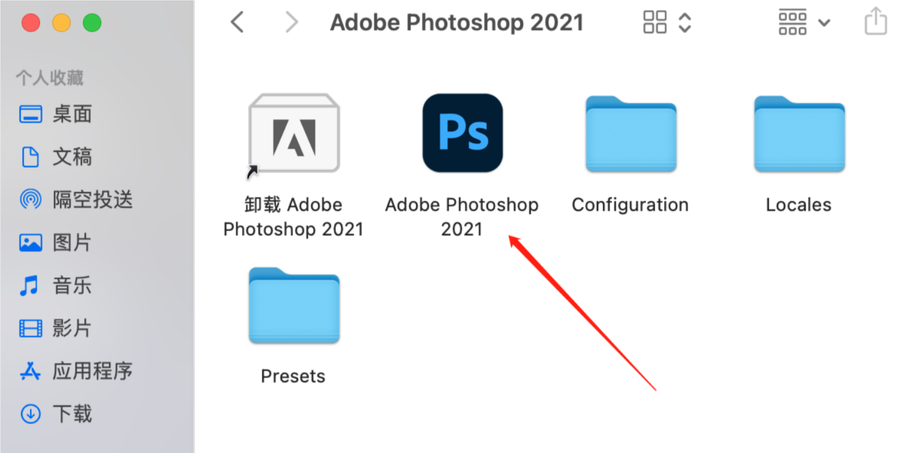
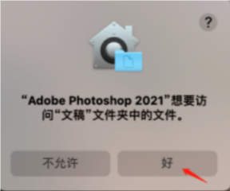

# Mac系统安装教程

## 允许任何来源App

Mac系统在系统偏好设置中的**安全与隐私**模块里,默认关闭了允许**任何来源App**,并为隐藏状态.如果不开启,会导致在安装或者运行一些第三方软件的时候出现错误.(打开第三方软件的时候经常报错:该镜像已损坏,请移至废纸篓)

请按着[这篇文档](Mac用户必看)做

## 下载软件安装包

## 开始安装

**首先先断开网络WiFi**,然后双击打开下载好的安装包

右键单击**Install**并点选**显示包内容**(千万不要双击打开了)

进入`Contents-MacOS`,双击`Install`进行安装

输入密码后点击好 

> [!caution]
>
> 如果双击`install`之后没有出现输入框,请开启网络按照这篇[文档](Mac系统安装使用报错解决办法#Mac启动应用提示无法检查更新)做一下
>
> 做好之后再断开网络继续双击install开始安装

点击继续

在`访达`中点击`应用程序`并找到安装好的软件打开即可使用

如果弹出权限申请,点击好

至此,软件已成功安装,双击即可使用,且永久免费,其它软件安装步骤与以上步骤一样
