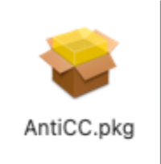
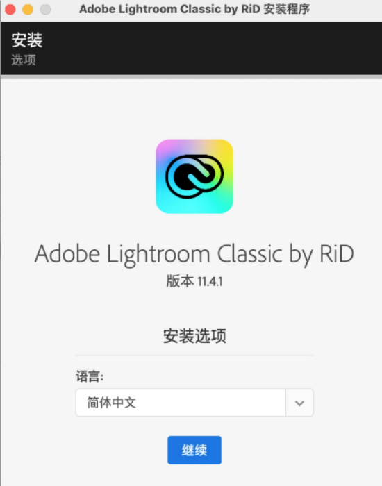

# Mac系统2022~23通用安装教程

## 允许任何来源App

Mac系统在系统偏好设置中的**安全与隐私**模块里,默认关闭了允许**任何来源App**,并为隐藏状态.如果不开启,会导致在安装或者运行一些第三方软件的时候出现错误.(打开第三方软件的时候经常报错:该镜像已损坏,请移至废纸篓)

请按着[这篇文档](Mac用户必看)做

## 下载软件安装包

## 开始安装

双击打开下载好的安装包,双击AnitCC.pkg进行安装,如果你已经安装过,可以跳过这个步骤

安装完后,双击`Install`进行安装,打开如果提示安装Rosetta点击安装,然后再次双击Install进行安装

可能会转圈比较慢,等待即可,如有提示输入钥匙串的,请输入密码然后点击始终允许,可能要输入几次,然后点击`继续`,安装好之后点击关闭。

## 安装补丁

双击补丁进行安装,打开之后一直下一步下一步提示安装成功,提示移除点击`移除`即可

至此全部步骤安装完成