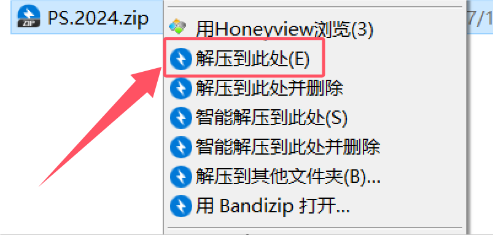
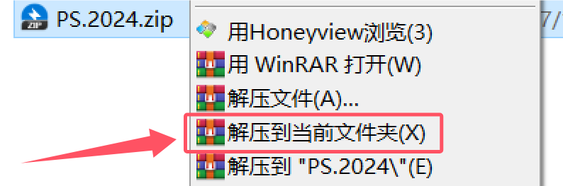
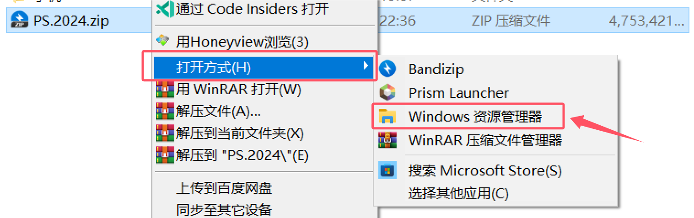
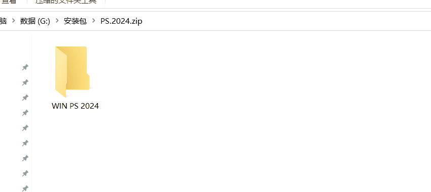
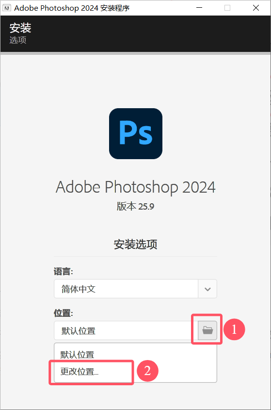
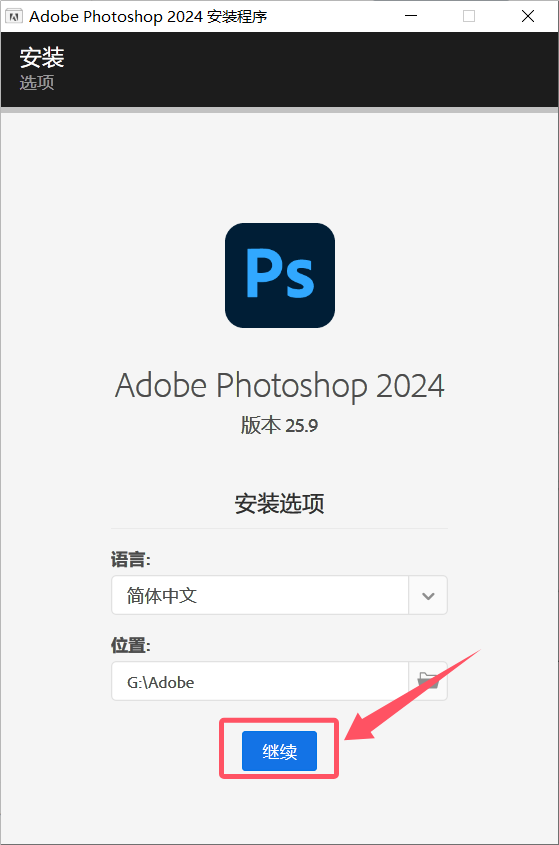
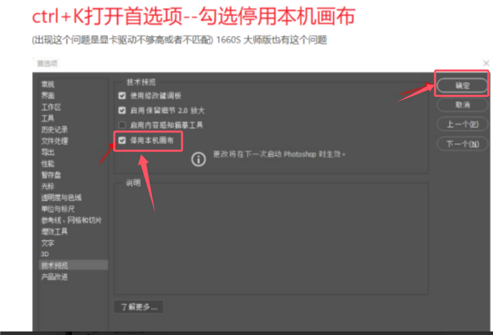

# Win系统安装教程

 

## 退出杀软

安装时可能需要退出杀毒软件,包括但不限于360安全卫士,360杀毒,金山毒霸,火绒安全,2345安全卫士等

并且需要关闭微软安全

无需担心软件有病毒,Adobe的所有软件在安装时均会写入电脑注册表信息,此行为可能会被杀毒软件阻止,最终导致安装失败

## 下载软件安装包

## 解压安装包

如果你的解压软件是Bandizip,那就点这里

如果你的解压软件是WinRAR,那就点这里

如果你什么都没有,那就用资源管理器(最好还是下一个压缩包软件,很常用的)

## 开始安装

进入解压出的文件夹里,右键`Set-up.exe`,点击以管理员身份运行

修改安装路径,不要安装在默认路径了,默认是在C盘的,需要换到其他盘符

耐心等待到安装完成,安装完成后即可使用,且永久免费,其它软件安装步骤与以上步骤一样

## 常见问题

+ 安装完成了,但是桌面没有快捷方式 +

    Win10:

    

    Win11:

    

### 安装报错代码160,127

1. 关闭所有杀毒再安装
2. 如果还是不行的话,去打开`系统设置-应用-搜索2345`找到**2345安全卫士**和**安全组件**这两个都卸载了再安装
3. 如果没有2345的情况下,打开此电脑,然后依次打开`C盘-ProgramFiles(x86)-CommonFiles-Adobe`进去删除**caps**和**OOBE**这2个文件夹,再安装

### 安装报错提示需要升级Creative Cloud Desktop version 5.2

载这个运行卸载之后,再去安装即可.[点我下载](https://alist.elake.top/Creative%20Cloud%E5%8D%B8%E8%BD%BD%E7%A8%8B%E5%BA%8F.exe)

### 打开提示丢失MSVCR110/120/140.dll

系统缺少组件了,下载这个安装之后,再去打开即可.[点我下载](https://alist.elake.top/MSVBCRT.AIO.2019.07.20.X86+X64.exe)
### 打开PR,AE,PS显示 系统兼容性报告 显卡驱动不支持

那是你的显卡驱动老旧了,修复显卡驱动问题(进去选择对应的显卡类型,比如你的显卡是3060,就选择1050到4090这个,下载好直接双击安装,安装好重启PR,AE,PS之类的软件即可).[点我下载](https://alist.elake.top/NVDIA%E6%98%BE%E5%8D%A1%E9%A9%B1%E5%8A%A8%E4%BF%AE%E5%A4%8D)
### 安装报错代码182

缺少微软运行库,打开下载这个VC++安装之后,再去安装Visual C++下载地址.[点我下载](https://alist.elake.top/VC_redist.x64.exe)

### 无法启动此程序,因为计算机中丢失api-ms-win-crt-runtime-l1-1-0.dll

这个是因为电脑中缺失这个程序导致的,下载一下api-ms-win-crt-runtime-l1-1-0.dll安装一下就好.[点我下载](https://alist.elake.top/%E8%AE%A1%E7%AE%97%E6%9C%BA%E4%B8%AD%E4%B8%A2%E5%A4%B1api-ms-win-crt-runtime-l1-1-0.dll%E7%9A%84%E4%BF%AE%E5%A4%8D%E6%96%B9%E6%A1%88_1.0.exe)

### 无法正常启动错误0xc000007b的解决办法

按照这个教程做.[点我查看](https://365.kdocs.cn/l/cljI2bsqeBAg)

### 无法正常启动错误0xc0000005的解决办法

按照这个教程做.[点我查看](https://365.kdocs.cn/l/cqSo0IfFAP46)

### 安装报错代码176

打开此文件夹`C:\Program Files (x86)\Common Files\Adobe`,删除`OOBE`还有`caps`两个文件夹,然后再去安装即可

### PS2021~2023版本打开使用有屏闪,闪屏

设置好之后重启下PS即可