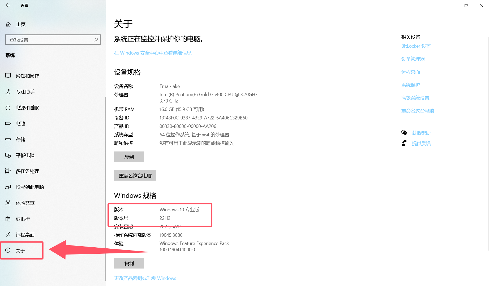

# Win系统查看版本号方法

按下快捷键`Win+I`打开设置界面

|        版本号        | Adobe版本  |
| :------------------: | :--------: |
| `21H1`,`22H2`,`23H2` | 2024或以下 |
|        `20H1`        | 2023或以下 |
| `2004`,`2009`,`1909` | 2022或以下 |
|        `1809`        | 2020或以下 |
|        `1709`        | 2018或以下 |
|        `1607`        | 2017或以下 |

参照上面的表格,选择自己合适的版本安装