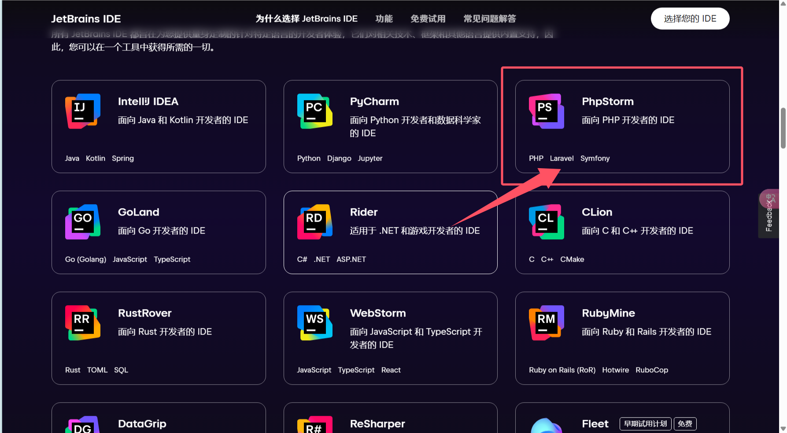
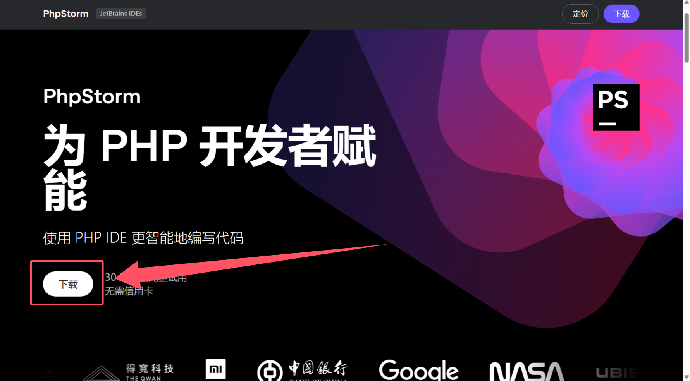
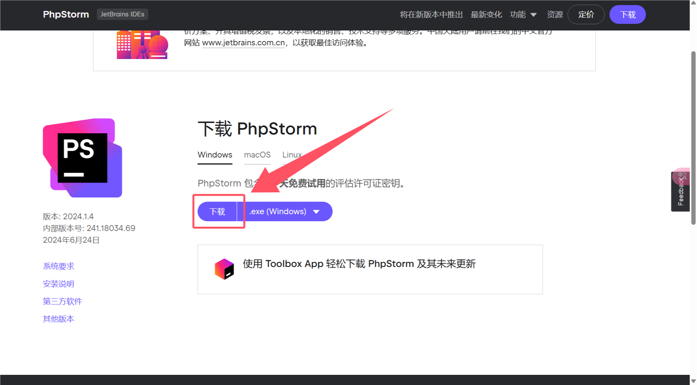
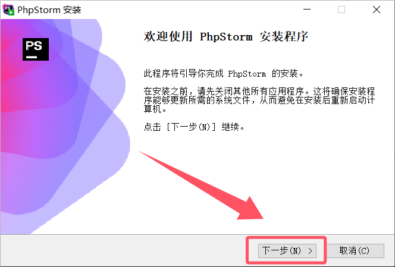
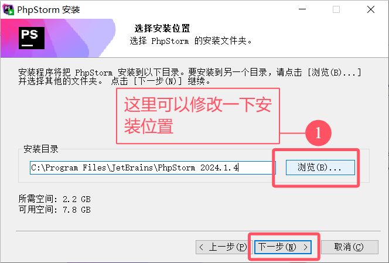
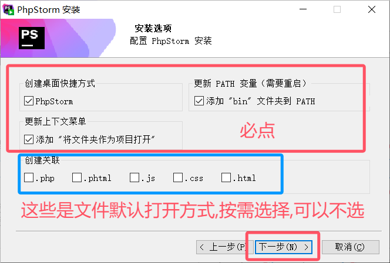
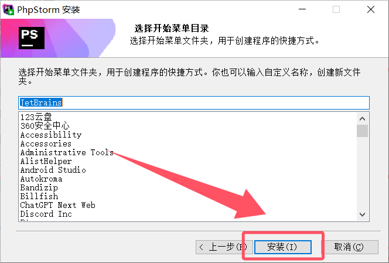
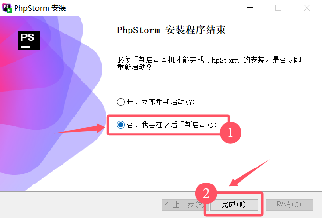
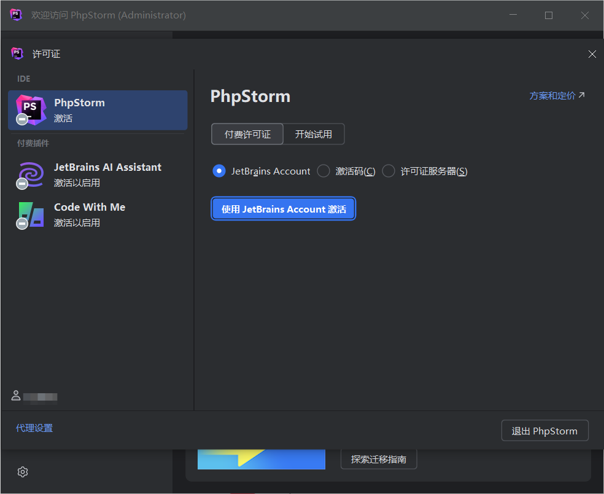
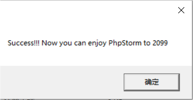

# Win系统使用教程

本文档以安装Php Storm为例

## 下载软件

软件需要前往官网下载.[点击前往](https://www.jetbrains.com/zh-cn/ides/)

往下滑,找到我们需要下载的IDE,点进去

点击下载

再次点击下载

请等待软件下载完成

## 安装软件

下载完成后,双击运行刚刚下载的安装程序

> [!caution]
>
> 

等待安装完成

## 运行软件

安装完后,我们需要先运行一遍软件

双击桌面图标运行,出现这个界面,就可以退出了(你们应该是英文的)

## 解压激活补丁

如果你的解压软件是Bandizip,那就点这里

如果你的解压软件是WinRAR,那就点这里

如果你什么都没有,那就用资源管理器(最好还是下一个压缩包软件,很常用的)

## 运行激活补丁

进入解压出的文件夹里,找到你要激活的软件对应的补丁

比如我刚刚安装的是Php Storm,需要激活的就是Php Storm了,然后找到`Php Storm激活.vbs`

双击运行

出现这个界面,就激活成功了

## 中文汉化

点击`Plugins`插件

安装完后,需要重启IDE

这样子,软件就算安装完成了,其它软件安装步骤与以上步骤一样