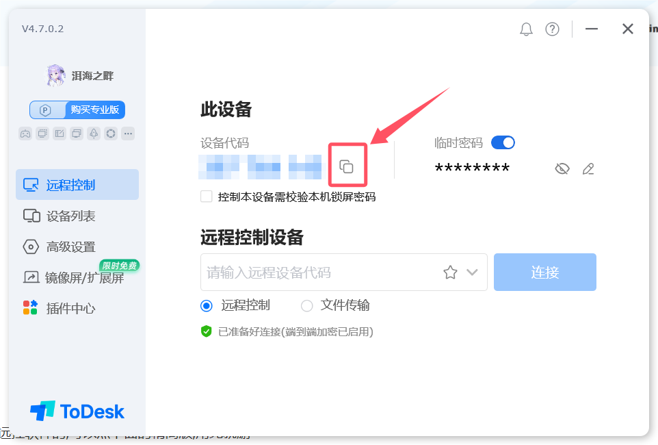

# 远程须知

购买了远程安装的看这里

首先需要下载远控软件[ToDesk](https://www.todesk.com/download.html)

不常用远控软件的,可以点下面的精简版,用完就删

> [!caution]
>
> 需保证网络流畅,不卡顿

## 完整版

点复制后,将远程代码发给客服即可

不会的,或者觉得不方便的,也可以直接用手机拍屏幕,需要将设备代码和密码都拍进去

## 精简版

点击`复制代码`,将复制的东西发给客服即可

不会的,或者觉得不方便的,也可以直接用手机拍屏幕,需要将设备代码和密码都拍进去