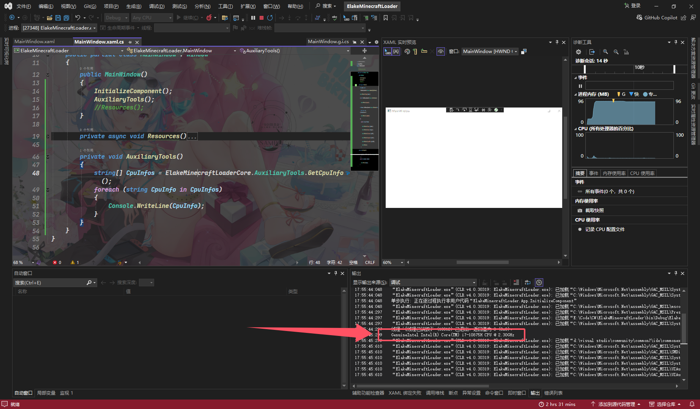

# 获取CPU信息数组

|  属性  |               值                |
| :----: | :-----------------------------: |
| 方法名 |         `GetCpuInfo()`          |
|  描述  | 获取CPU信息数组(品牌,型号,主频) |
|  返回  |       CPU信息数组 字符串        |

## 例子

```C#
private void AuxiliaryTools()
{
    string[] CpuInfos = ElakeMinecraftLoaderCore.AuxiliaryTools.GetCpuInfo();
    foreach (string CpuInfo in CpuInfos)
    {
        Console.WriteLine(CpuInfo);
    }
}
```



