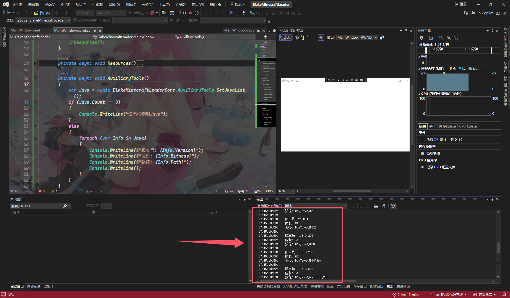

# 获取Java的列表

|  属性  |                              值                              |
| :----: | :----------------------------------------------------------: |
| 方法名 |                       `GetJavaList()`                        |
|  描述  | 获取Java列表(版本号,位数,路径),使用where指令查找,耗时较长,只返回有效的Java |
|  返回  |       Java列表 列表([`JavaInfoList`](JavaInfoList.md))       |

## 例子

```C#
private async void AuxiliaryTools()
{
    var Java = await ElakeMinecraftLoaderCore.AuxiliaryTools.GetJavaList();
    if (Java.Count == 0)
    {
        Console.WriteLine("没有检测到Java");
    }
    else
    {
        foreach (var Info in Java)
        {
            Console.WriteLine($"版本号: {Info.Version}");
            Console.WriteLine($"位长: {Info.Bitness}");
            Console.WriteLine($"路径: {Info.Path}");
            Console.WriteLine();
        }
    }
}
```



