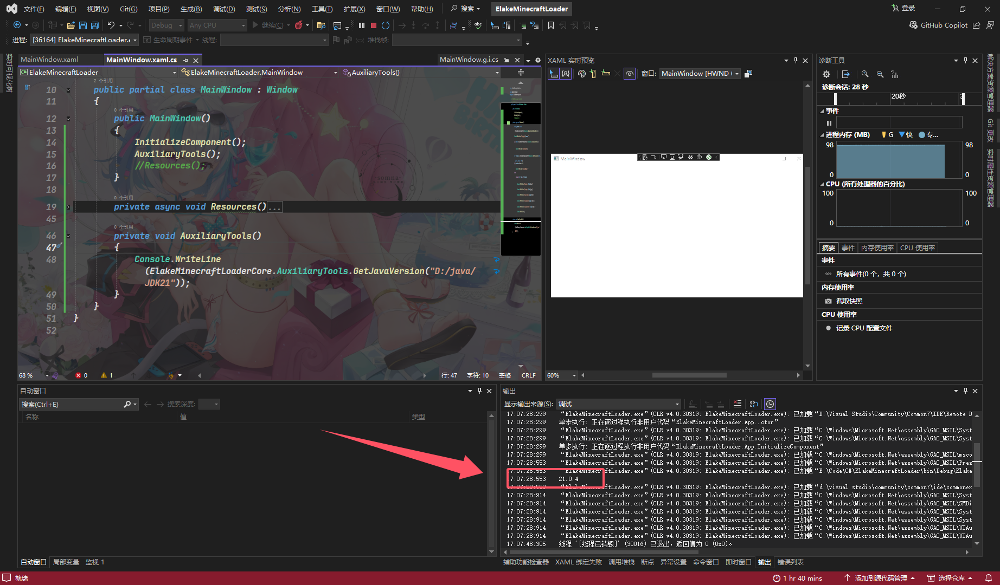

# 获取Java的版本号

|      属性       |                值                |
| :-------------: | :------------------------------: |
|     方法名      |        `GetJavaVersion()`        |
|      描述       | 通过输入Java路径来获取Java版本号 |
| 参数 `JavaPath` |         Java路径 字符串          |
|      返回       |          版本号 字符串           |

## 例子

```C#
private void AuxiliaryTools()
{
    Console.WriteLine(ElakeMinecraftLoaderCore.AuxiliaryTools.GetJavaVersion("D:/java/JDK21"));
}
```



