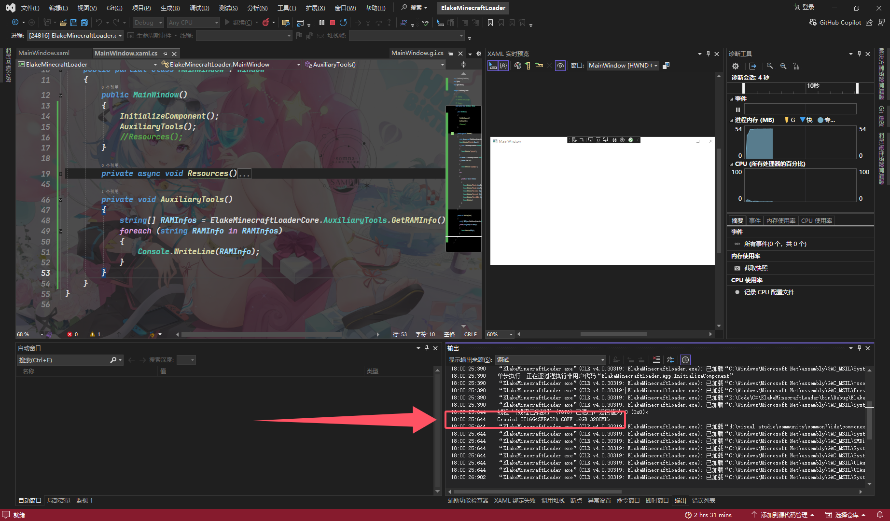

# 获取RAM的版本号

|  属性  |                  值                  |
| :----: | :----------------------------------: |
| 方法名 |            `GetRAMInfo()`            |
|  描述  | 获取RAM信息数组(品牌,型号,容量,速度) |
|  返回  |          RAM信息数组 字符串          |

## 例子

```C#
private void AuxiliaryTools()
{
    string[] RAMInfos = ElakeMinecraftLoaderCore.AuxiliaryTools.GetRAMInfo();
    foreach (string RAMInfo in RAMInfos)
    {
        Console.WriteLine(RAMInfo);
    }
}
```



