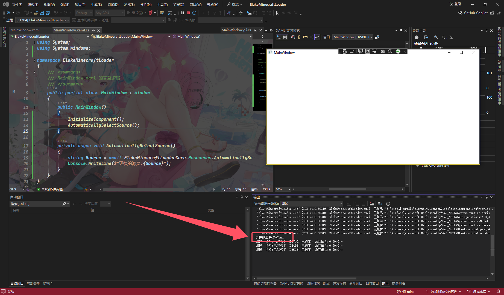

# 自动选择延迟更低的源

|  属性  |              值               |
| :----: | :---------------------------: |
| 方法名 | `AutomaticallySelectSource()` |
|  描述  | 自动选择`MoJang`或`BMCLAPI`源 |
|  返回  |  字符串(`MoJang`,`BMCLAPI`)   |

## 例子

```C#
private async void Resources()
{
    string Source = await ElakeMinecraftLoaderCore.Resources.AutomaticallySelectSource();
    Console.WriteLine($"更快的源是:{Source}");
}
```


