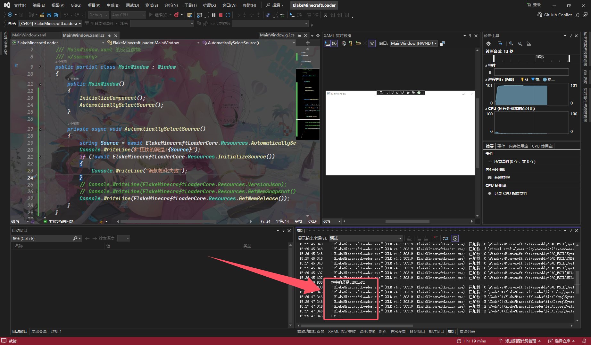

# 获取最新的正式版本

|       属性        |                           值                           |
| :---------------: | :----------------------------------------------------: |
|      方法名       |                   `GetNewRelease()`                    |
|       描述        |                   获取最新的正式版本                   |
| 参数 `SourceJson` | 源Json 字符串(默认使用[`VersionJson`](VersionJson.md)) |
|       返回        |                     字符串(版本号)                     |

## 例子

```C#
private async void Resources()
{
    string Source = await ElakeMinecraftLoaderCore.Resources.AutomaticallySelectSource();
    Console.WriteLine($"更快的源是:{Source}");
    if (!await ElakeMinecraftLoaderCore.Resources.InitializeSource())
    {
        Console.WriteLine("源初始化失败");
    }
    // Console.WriteLine(ElakeMinecraftLoaderCore.Resources.VersionJson);
    // Console.WriteLine(ElakeMinecraftLoaderCore.Resources.GetNewSnapshot());
    Console.WriteLine(ElakeMinecraftLoaderCore.Resources.GetNewRelease());
}
```

