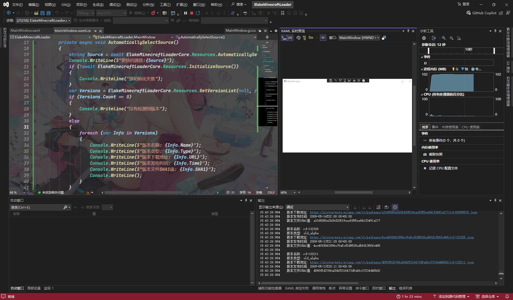

# 获取版本列表

|       属性        |                           值                           |
| :---------------: | :----------------------------------------------------: |
|      方法名       |                   `GetVersionList()`                   |
|       描述        |                      获取版本列表                      |
| 参数 `SourceJson` | 源Json 字符串(默认使用[`VersionJson`](VersionJson.md)) |
|  参数 `Release`   |          是否获取正式版 布尔值(默认使用true)           |
|  参数 `Snapshot`  |          是否获取快照版 布尔值(默认使用true)           |
|    参数 `Old`     |          是否获取远古版 布尔值(默认使用true)           |
|       返回        | 版本列表 列表([`VersionInfoList`](VersionInfoList.md)) |

## 例子

```C#
private async void Resources()
{
    string Source = await ElakeMinecraftLoaderCore.Resources.AutomaticallySelectSource();
    Console.WriteLine($"更快的源是:{Source}");
    if (!await ElakeMinecraftLoaderCore.Resources.InitializeSource())
    {
        Console.WriteLine("源初始化失败");
    }
    var Versions = ElakeMinecraftLoaderCore.Resources.GetVersionList(null, false, false, true);
    if (Versions.Count == 0)
    {
        Console.WriteLine("没有检测到版本");
    }
    else
    {
        foreach (var Info in Versions)
        {
            Console.WriteLine($"版本名称: {Info.Name}");
            Console.WriteLine($"版本类型: {Info.Type}");
            Console.WriteLine($"版本下载地址: {Info.URL}");
            Console.WriteLine($"版本发布时间: {Info.Time}");
            Console.WriteLine($"版本文件SHA1值: {Info.SHA1}");
            Console.WriteLine();
        }
    }
}
```

