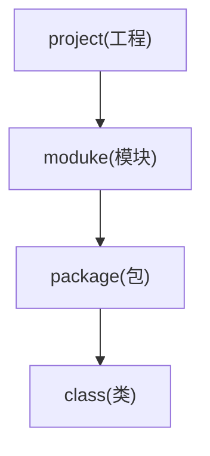
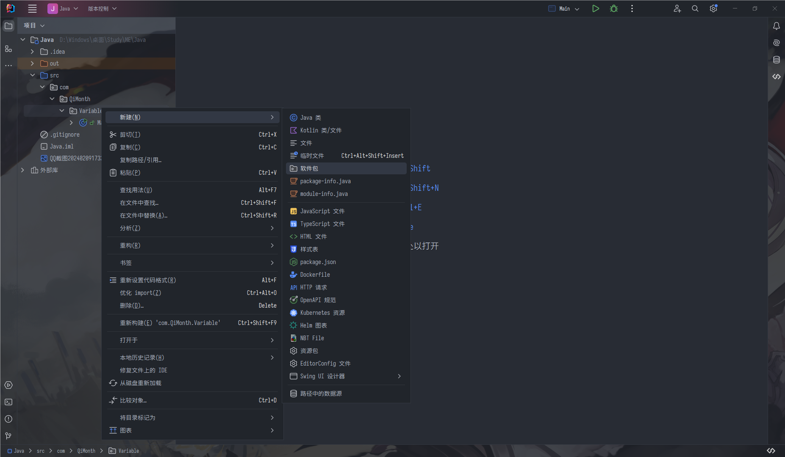
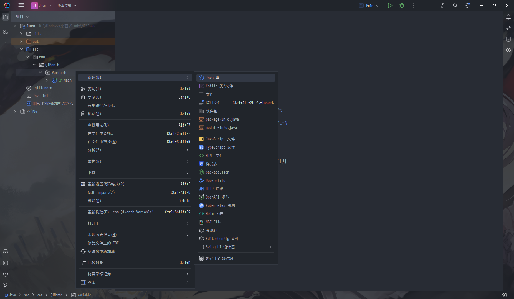

# Java项目的代码结构

我来举个例子,比如说我要写个B站

* B站系统(project)
    * 首页(moduke)
        * 用户界面(package)
            * 主页(class)
            * 视频播放器(class)
            * 搜索栏(class)
        * 数据服务(package)
            * 视频服务(class)
            * 用户服务(class)
    * 个人主页(moduke)
        * 用户界面(package)
            * 个人资料页面(class)
            * 关注列表(class)
        * 数据服务(package)
            * 简介服务(class)
            * 会计服务(class)
    * 推荐(moduke)
        * 个性化推荐(package)
            * 推荐算法(class)
            * 内容筛选器(class)
        * 用户界面(package)
            * 推荐列表(class)
            * 建议栏(class)

差不多就是这个样子,将不同的功能分开

## 在IDEA创建project

## 在IDEA创建moduke

## 在IDEA创建package

## 在IDEA创建class

