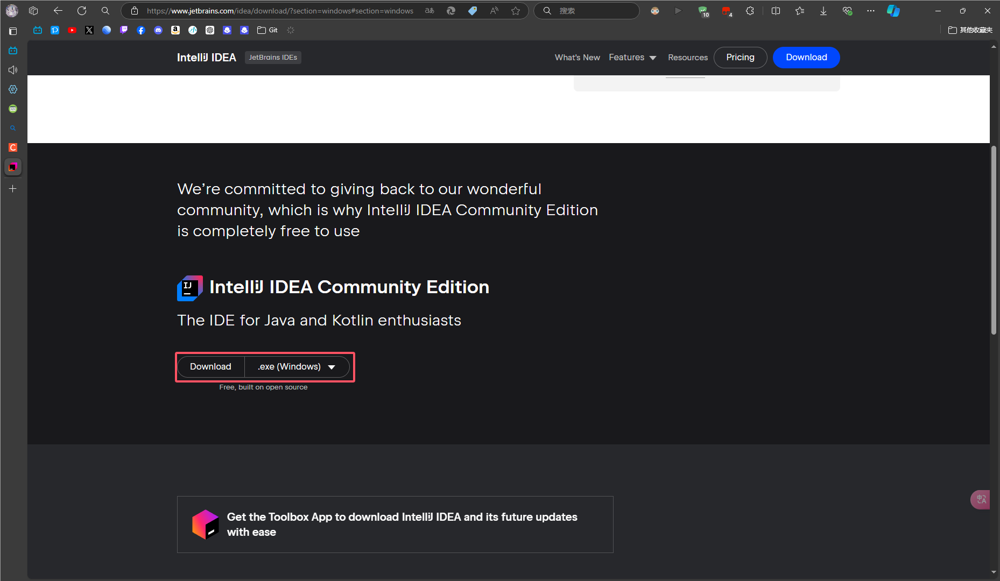
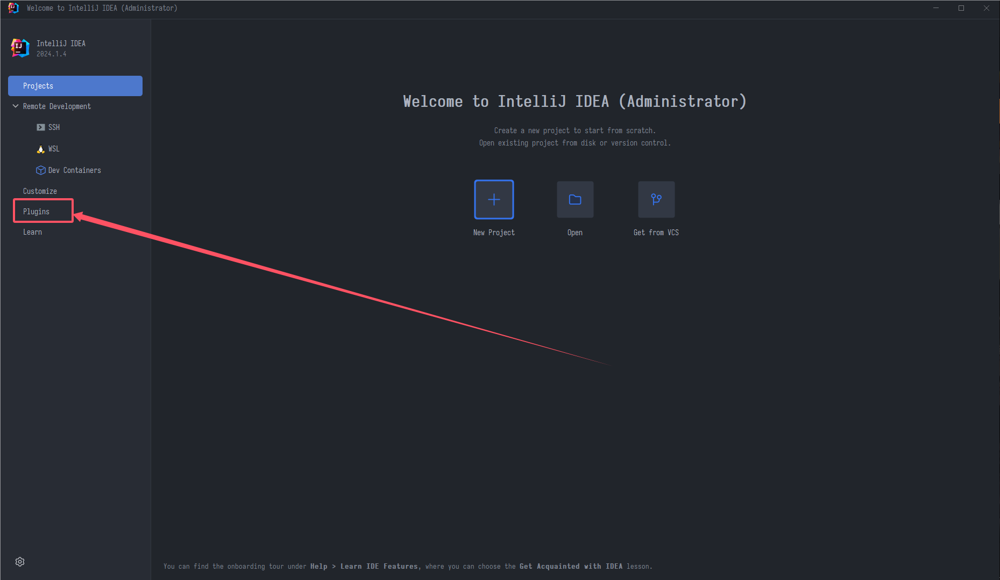
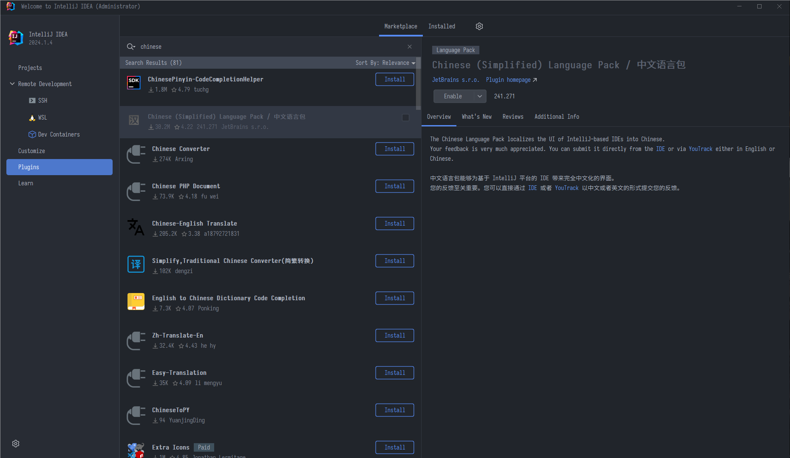
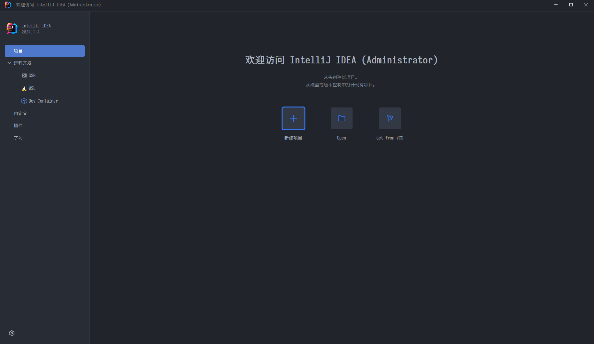

# 环境

### 环境变量

略

### 软件

首先编写**Java**建议使用的软件是[**IDEA**](https://www.jetbrains.com/zh-cn/idea/)(IntelliJ IDEA)下文主要简称**IJ**或**IDEA**

软件正版需要收费(你也可以选择自己破解,后果自行承担),当然你可以选择官方发行的另一个[**社区版**](https://www.jetbrains.com/idea/download),和正版的区别不大,只是缺少了些许无伤大雅的功能

进入页面后下滑

### 插件

打开软件后是英文的,在主界面点击左边的**Plugins**

随后在搜索框输入**Chinese**

然后点击**Install**等待安装,安装好后会让你重启,重启就好了

如果安装失败可以尝试挂魔法,这里不提供方法.或者尝试一下去官网下载插件然后本地导入

我这边已经安装了但是关掉了,所以是禁用的状态(**~~还不是为了写文档~~**)

汉化好后就是这个样子