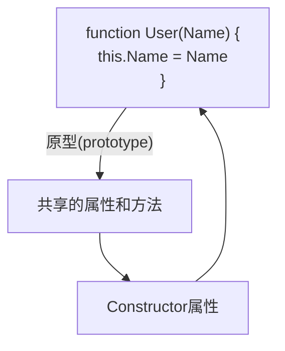
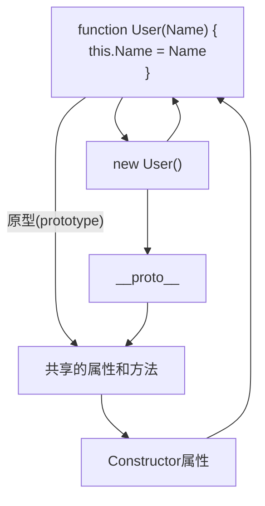
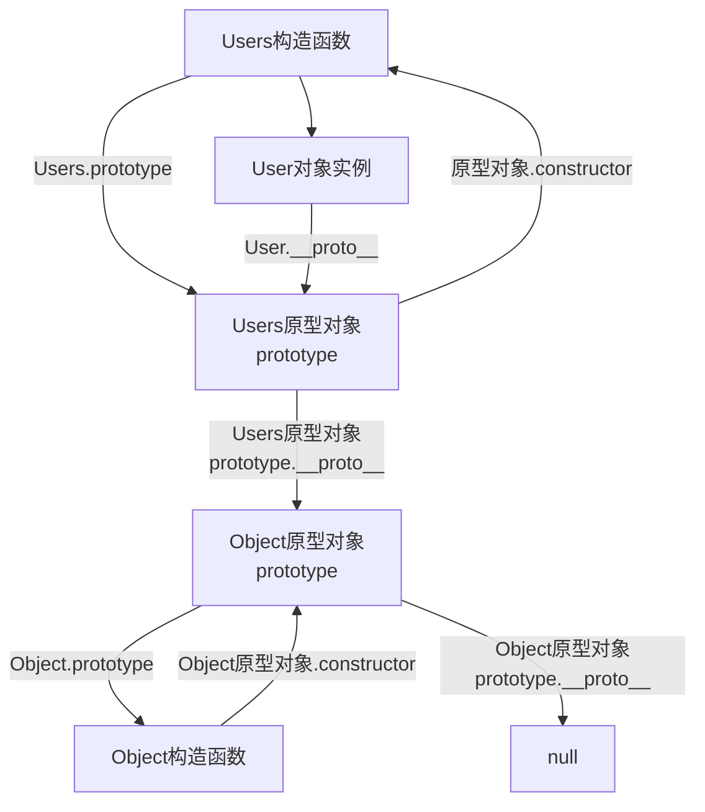

# 原型对象

> 如果不动,请自行查询文档,因为我感觉我写不明白(抱歉)

* 构造函数通过原型分配的函数是所有对象所**共享的**
* JS规定,**每一个构造函数都有一个`prototype`属性**,指向另一个对象,所以我们也称为原型对象
* 这个对象可以挂载函数,对象实例化不会多次创建原型上函数,节约内存
* **我们可以把那些不变的方法,直接定义在`prototype`对象上,这样所有对象的实例化就可以共享这些方法**
* **构造函数可原型对象中的`this`都指向实例化的对象**

```js
function User(Name, Age) {
    this.Name = Name
    this.Age = Age
}
// 直接写在prototype对象上
User.prototype.Hi = () => console.log('Hi~')
const Elake = new User('洱海', 18)
Elake.Hi()
// Hi~
```

## Constructor属性

每个原型对象里面都有个`constructor`属性(`constructor`构造函数)

这个属性**指向**该原型对象的**构造函数**

要不我给你写个图,大概就是这么个情况



```js
function User(Name) {
    this.Name = Name
}
console.log(User.prototype.constructor === User)
// true
```

### 重新指回原型构造函数

先来看几个代码块

```js
function Test() {
}
Test.prototype.A = () => console.log('A函数')
Test.prototype.B = () => console.log('B函数')
Test.prototype.C = () => console.log('C函数')
Test.prototype.D = () => console.log('D函数')
const T = new Test()
T.A()
T.B()
T.C()
T.D()
```

这样一个个加是不是太麻烦了

```js
function Test() {
}
console.log(Test.prototype)
Test.prototype = {
    A: () => console.log('A函数'),
    B: () => console.log('B函数'),
    C: () => console.log('C函数'),
    D: () => console.log('D函数')
}
console.log(Test.prototype)
const T = new Test()
T.A()
T.B()
T.C()
T.D()
```


这样有虽然方便了,但有一个问题了,`constructor`被覆盖了,这个构造函数的原型属于谁的,就不知道了

所以要重新指回这个原型的构造函数

```js
function Test() {
}
console.log(Test.prototype)
Test.prototype = {
    constructor: Test,
    A: () => console.log('A函数'),
    B: () => console.log('B函数'),
    C: () => console.log('C函数'),
    D: () => console.log('D函数')
}
console.log(Test.prototype)
const T = new Test()
T.A()
T.B()
T.C()
T.D()
```


## 对象原型

> [!caution]
>
> 原型对象不等于对象原型

每个对象都有一个属性`__proto__`指向构造函数的`prototype`原型对象,之所以我们对象可以使用构造函数`prototype`原型对象的属性和方法,就是因为对象有`__proto__`原型的存在



> [!caution]
>
> * `__proto__`是JS非标准属性
> * `[[prototype]]`和`__proto__`意义相同
> * 用来表明当前实例对象指向哪个原型对象`prototype`
> * `__proto__`对象原型里面也有一个`constructor`属性,**指向创建该实例对象的构造函数**

```js
function Test() {
}
const T = new Test()
console.log(T.__proto__ === Test.prototype)
// true
console.log(T.__proto__.constructor === Test)
// true
```

## 原型继承

继承是面向对象编程的一个特征,通过继承进一步提高代码封装的程度,JS中大多是借助原型对象实现继承的特征

```js
// 女人
function Woman() {
    this.Eays = 2
    this.Head = 1
}
const A = new Woman()
console.log(A)
// Woman {Eays: 2, Head: 1}

// 男人
function Man() {
    this.Eays = 2
    this.Head = 1
}
const B = new Man()
console.log(B)
// Man {Eays: 2, Head: 1}
```

不管是女的还是男的,都有2只眼睛,1个头,所以可以共用

```js
// 公共
const Person = {
    Eays: 2,
    Head: 1
}

// 女人
function Woman() {
}
// 继承Person
Woman.prototype = Person
Woman.prototype.constructor = Woman
const A = new Woman()
console.log(A)

// 男人
function Man() {
}
// 继承Person
Man.prototype = Person
Man.prototype.constructor = Man
const B = new Man()
console.log(B)
```

这种方法还有一个坏处,如果属性一样,方法不一样,加入女人要加一个`Hi`的方法,男人不需要,你怎么办

```js
// 公共
function Person() {
    this.Eays = 2
    this.Head = 1
}

// 女人
function Woman() {
}
// 继承Person
Woman.prototype = new Person()
Woman.prototype.constructor = Woman
Woman.prototype.Hi = () => console.log('Hi~')
const A = new Woman()
console.log(A)


// 男人
function Man() {
}
// 继承Person
Man.prototype = new Person()
Man.prototype.constructor = Man
const B = new Man()
console.log(B)
```


## 原型链

基于原型对象的继承使得不同构造函数的原型对象关联在一起,并且这种关联的关系是一种链状的结构,我们将原型对象的链状结构关系称为原型链



### 查找规则

1. 当访问一个对象的属性(包括方法时),首先查找这个**对象自身**有没有该属性
2. 如果没有就查找它的原型(也就是`__proto__`指向的**`protorype`原型对象**)
3. 如果还没有就查找原型对象的原型(**Object的原型对象**)
4. 以此类推,直到找到Object为止(**null**)
5. `__proto__`对象原型的意义就在于为对象成员查找机制提供一个方向,或者说一条路线
6. ,可以使用`instanceof`运算符用于检测构造函数的`protorype`属性是否出现在某个实例对象的原型链上

```js
function Test() {
}
const T = new Test()

console.log(T instanceof Test)
// true
console.log(T instanceof Object)
// true
console.log(T instanceof Array)
// false
```

