# 发布商品

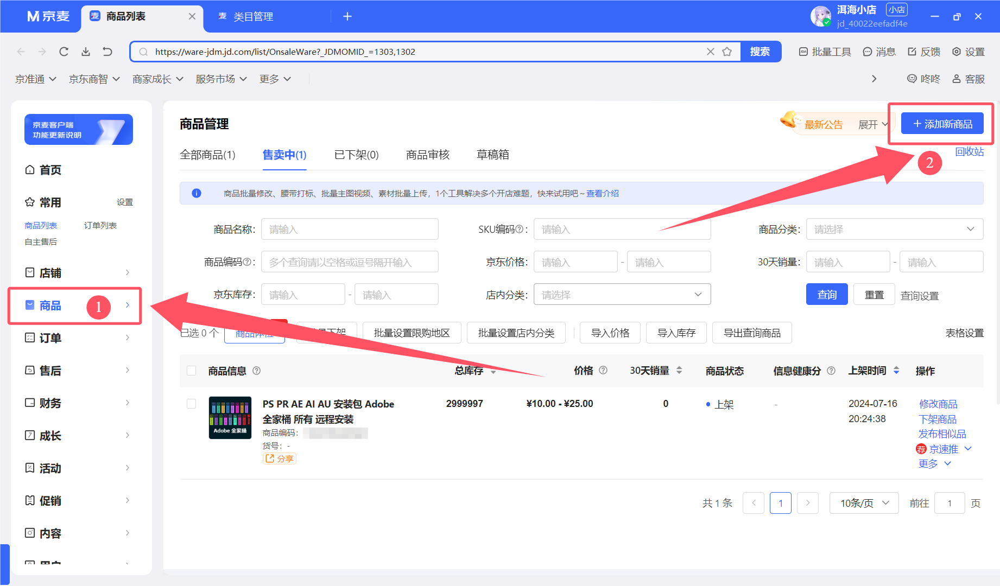

## 类别选择

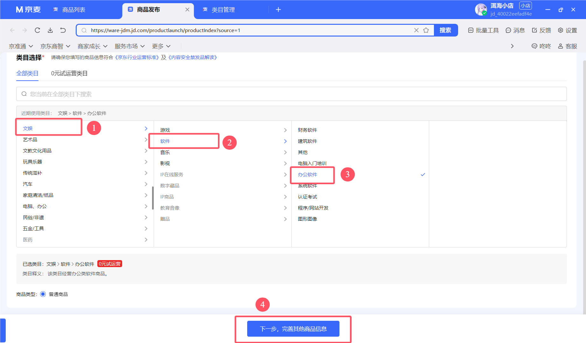

## 商品信息

首先,我选择**Adobe全家桶**来作为我第一个商品

### 商品标题

商品名词应该尽量包含更多的关键词,有利于用户搜索到,最多可以输入60个字符

其他可以留空,大家可以按需填写

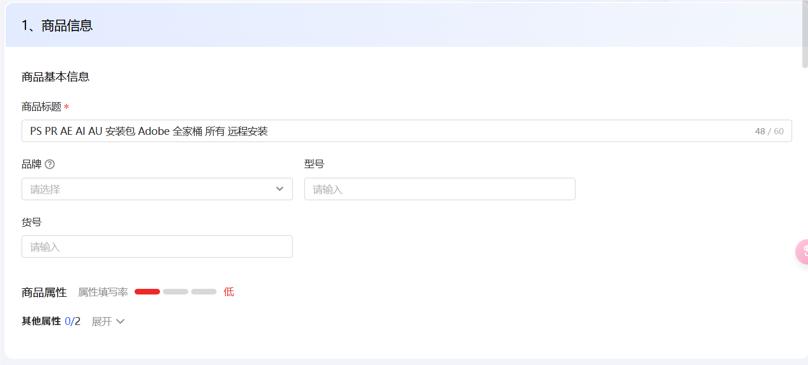

## 规格描述

### SPU主图

SPU主图就是商品的浏览图片,这里就需要大家动用一点点搜索能力和PS技术了

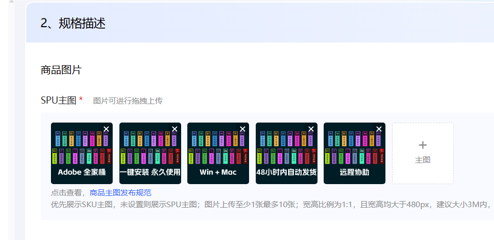

### 销售属性

#### 颜色

这里就是设置商品款式的地方...我举个例子吧

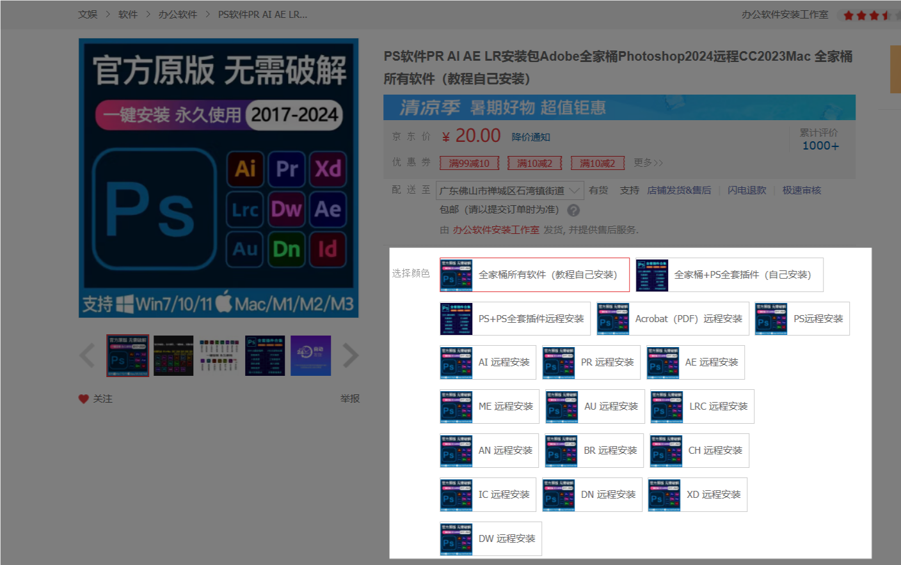

就是这个东西

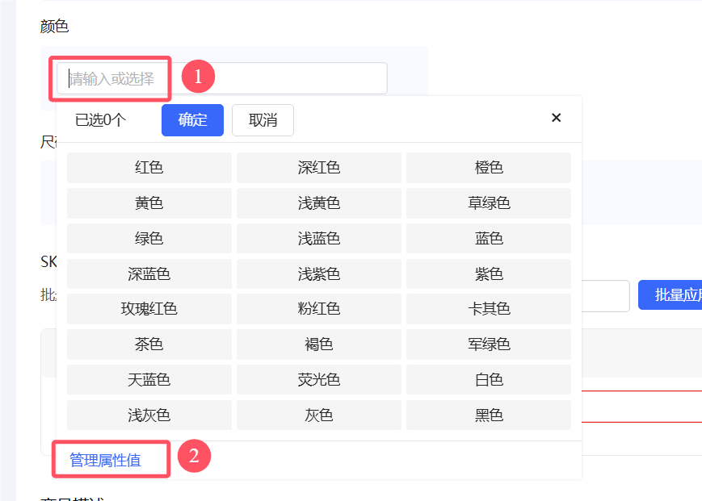

点击输入框,在弹出的列表里,点击下面的管理

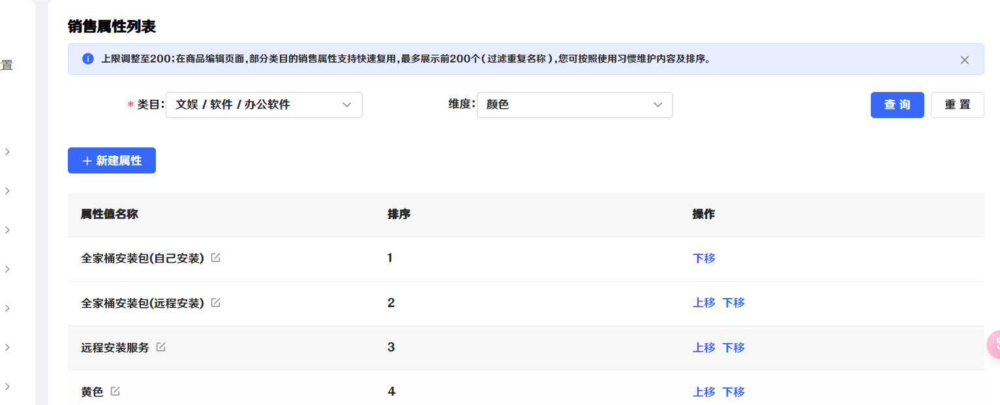

可以点击新建属性,也可以点击名字后面的修改,将默认的一堆颜色改掉

回到刚刚的页面,再次点击输入框,如果发现没有刚刚创建的属性,就**保存草稿**,然后刷新网页

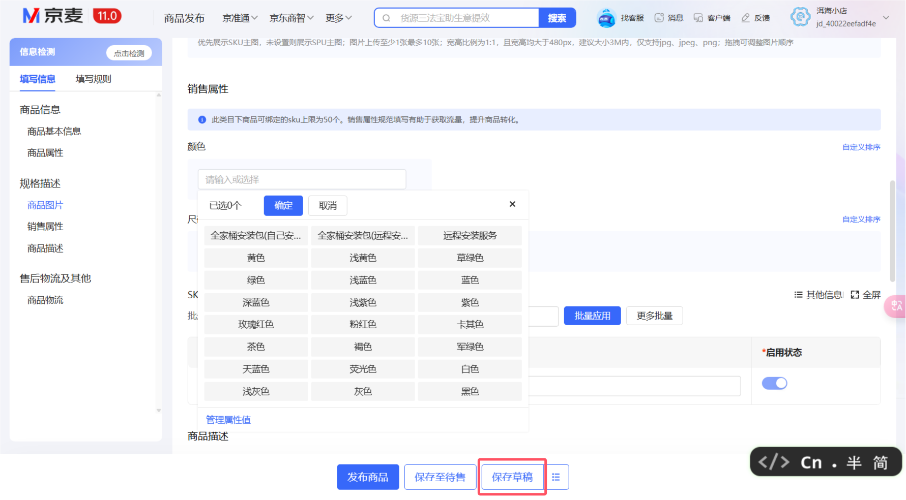

保存草稿旁边的列表图标,点击之后就可以展开草稿列表了,选择刚刚的草稿应用即可

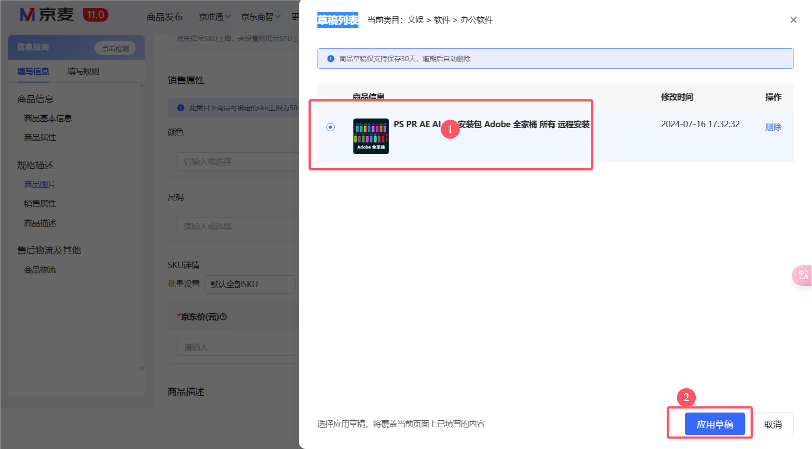

再再次点击输入框,选择刚刚创建的几个属性后确认

每个属性都需要设置SKU主图,和设置默认属性,都搞定后,就是这样的

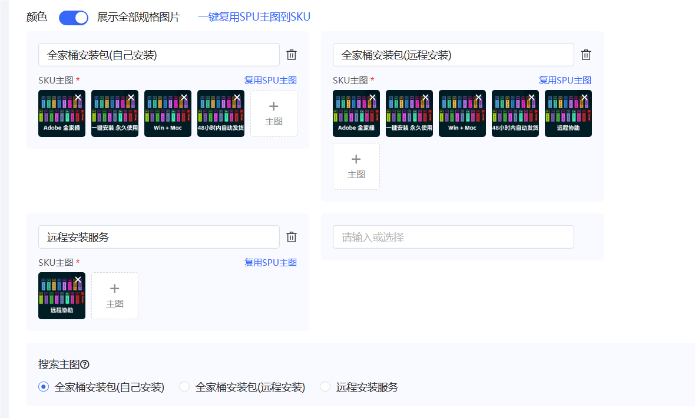

#### SKU详情

就是价格的地方,自己估摸一下就行

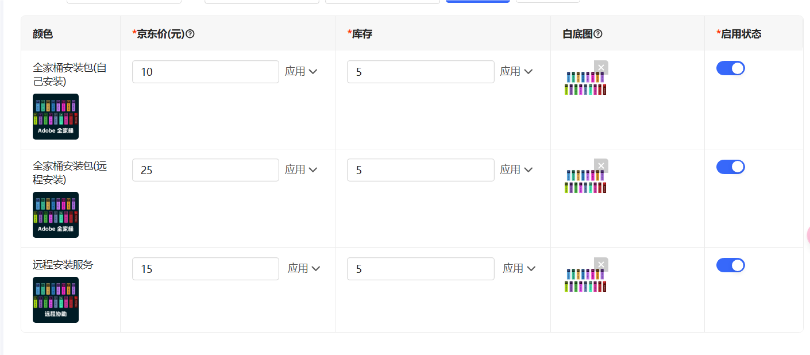

### 商品描述

这里就是设置商品详情页的地方

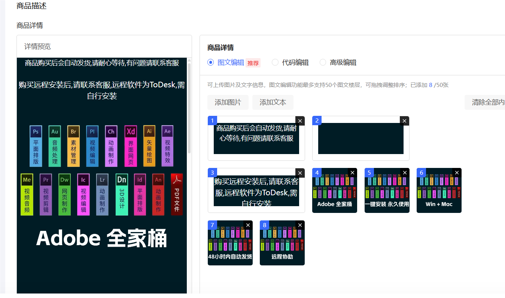

## 售后物流及其他

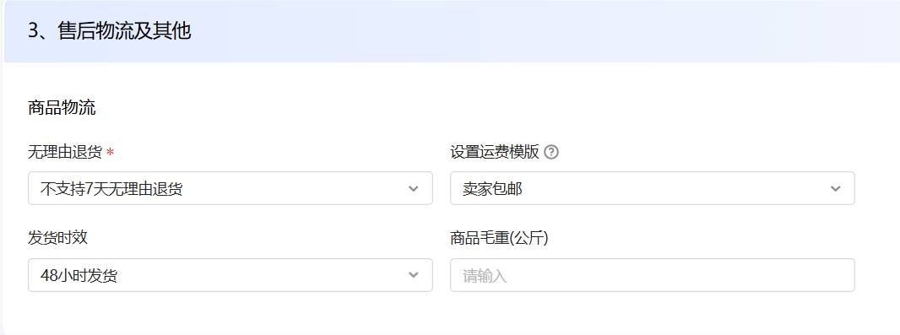

全部填完后,就可以点发布了,也是需要审核的,等待审核的过程中,

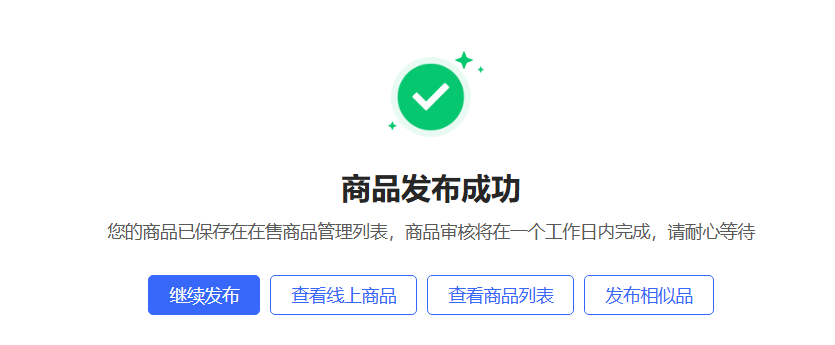

这样子就算过审了

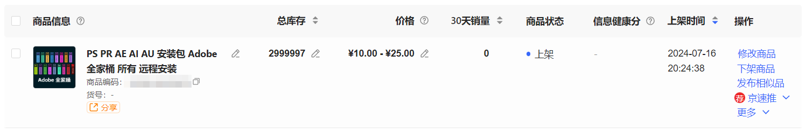