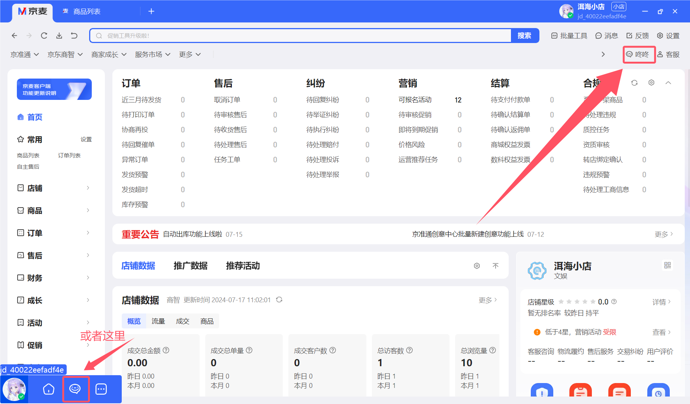
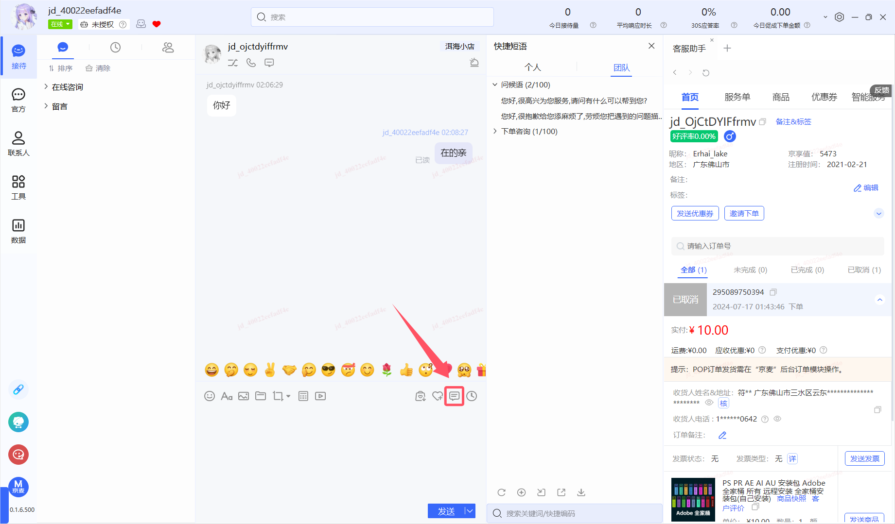
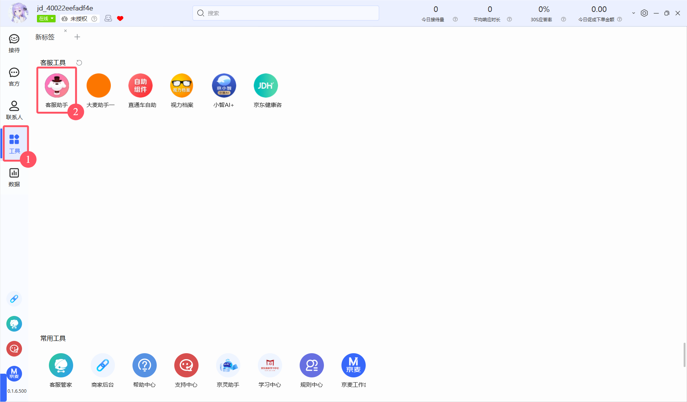

# 咚咚

咚咚是买家与卖之间的交流平台,就是客服

## 在线状态

点击左上角在线,可以显示状态列表

在线: 可以接待

离线: 无法接待

挂起: 可以接待当前已经接待的客户,无法接待新的客户

## 快捷短语

点击后,会弹出一个框

最上面的个人,指的是自己创建的快捷短语,团队指的是主账号创建的快捷短语

他们的区别是,个人是只有自己能查看,其他子账号无法查看,团队是共享的,所有账号都可以查看

下方的操作控件,从左到右依次是:刷新,新增,导入,导出,下载(鼠标悬停能看见的)

## 客服助手

界面最右边就是客服助手,如果没有,在这里可以加入

客服助手可以查看当前客户的信息,买了什么

也可以快捷发送优惠卷,邀请下单,发票,商品,物流等信息

功能很多,十分方便

## 其他功能

咚咚的功能很多,其他的请自行探索,鼠标悬浮在控件上,会显示控件标题的

