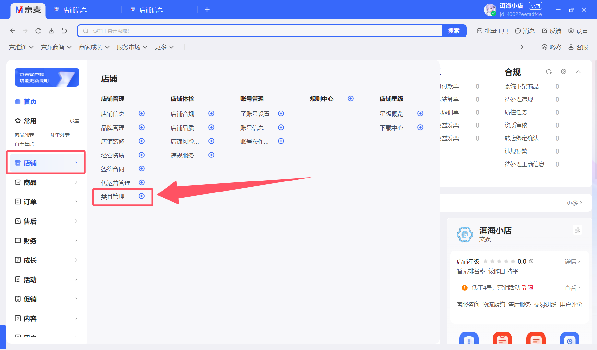
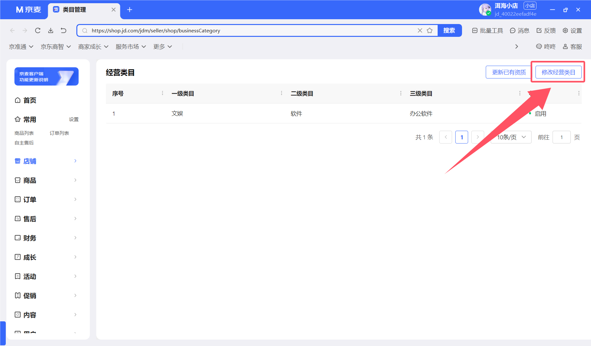
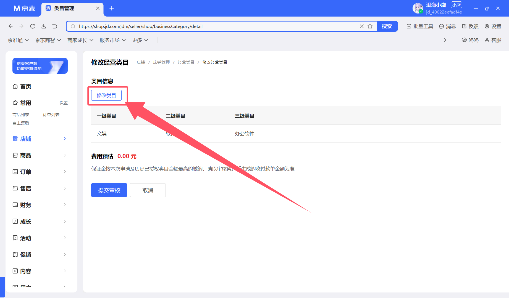
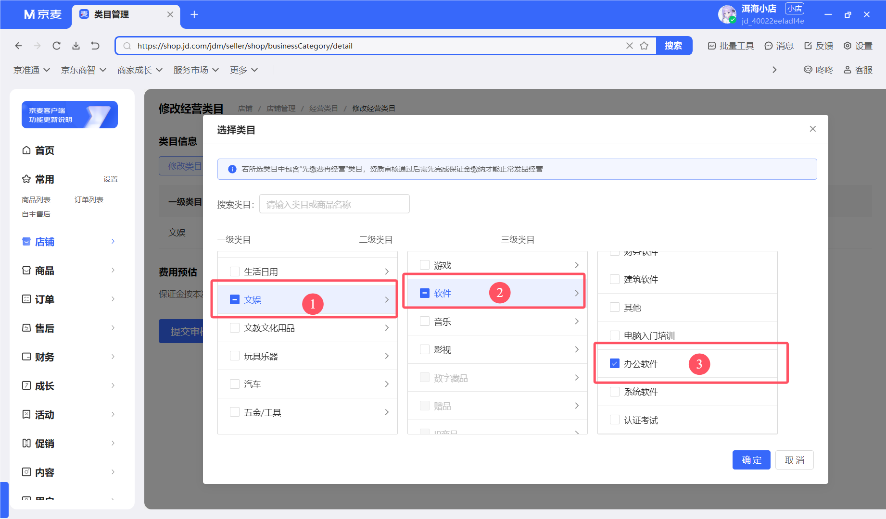
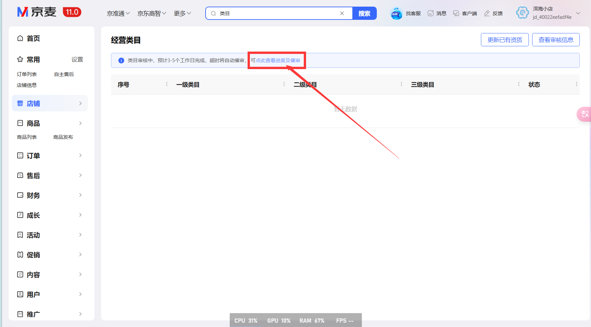
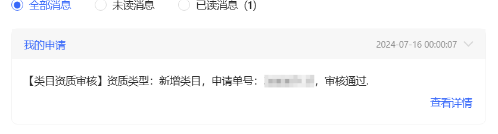

# 店铺设置

## 修改基础信息

> [!caution]
>
> 店铺名称和店铺Logo,每年最多修改6次
>
> 店铺Logo尺寸需要300$\times$300和180$\times$60的

设置完成不留空,会自动更新

## 修改联系人

这样就可以了,验证码收到飞起

## 绑定银行卡

以下操作在App上会方便点

点击立刻绑定

然后添加账号

在弹出的窗口选择银行卡,如果没有就点下面的添加(我这里的界面不一样是因为我已经添加过了,但是大同小异)

## 商品类目

点击确定后,提交审核即可(预计3-5个工作日)

可以在这里面的类目资质审核查看审核进度,或者催审

Ps:我差不多2天不到就过了

