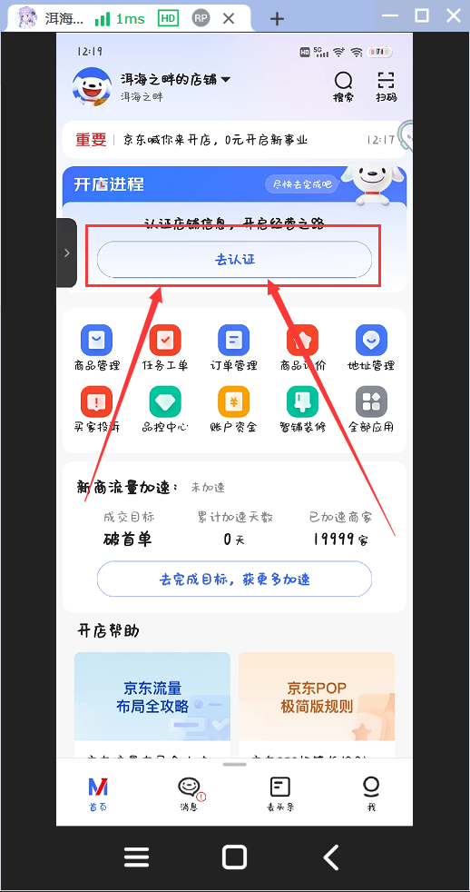
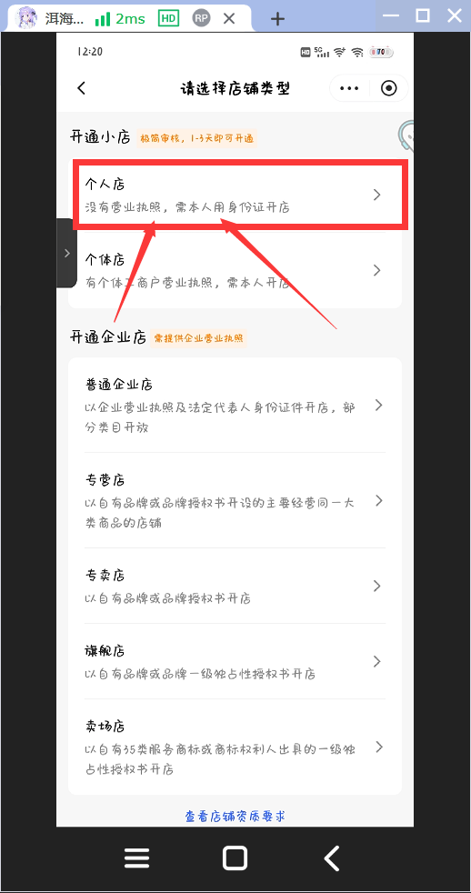
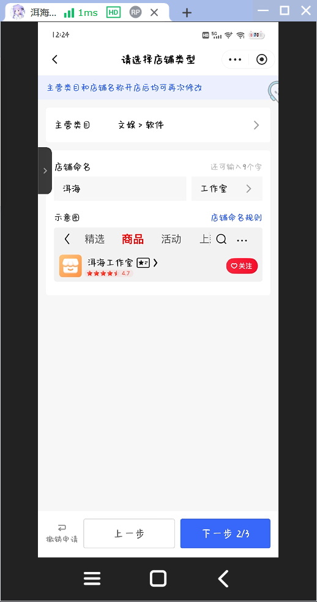
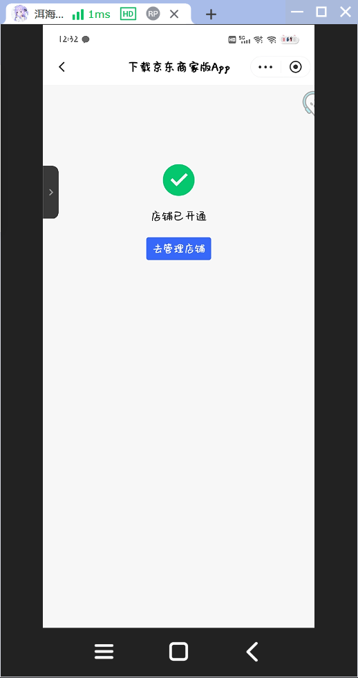

# 认证

## 去认证

在App首页点击去认证.如图:

## 个人店

我们只是开个个人店,所以点击第一个.如图:

## 设置店铺类型

主营类目选择**文娱**然后在选择**软件**,然后设置店铺命名.如图:

设置完后点击下一步

## 实名认证

输入姓名和身份证号,再次点击下一步就可以扫脸了.(要摄像头权限的)

> [!warning]
>
> 实名认证的年龄要在16周岁以上

扫脸通过后点击下一步

## 上传身份证

拍照上传身份证正反面后点击提交

> [!tip]
>
> 如果手机支持NFC,可以使用NFC获取

## 等待

资料提交后需要等待1~2天

应该很快的,我刚提交就通过了,甚至没来得及截图

店铺开通后,就可以通过浏览器扫码登录了